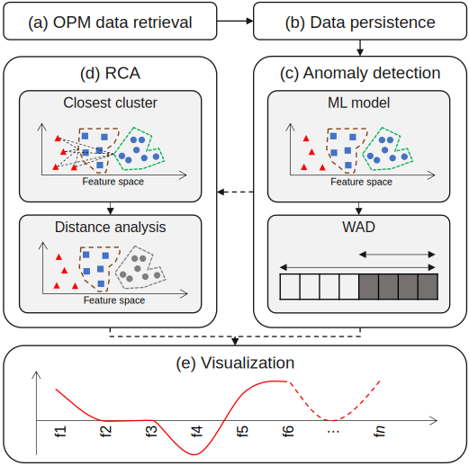

# Root Cause Analysis for Autonomous Optical Networks: A Physical Layer Security Use Case

[Carlos Natalino](https://www.chalmers.se/en/staff/Pages/Carlos-Natalino-Da-Silva.aspx), Andrea Di Giglio, Marco Schiano, [Marija Furdek](https://www.chalmers.se/en/staff/Pages/Marija-Furdek-Prekratic.aspx)

This is the repository for the work presented at the ECOC 2020, Brussels.

The authors' version of the paper is available [here](https://research.chalmers.se/en/publication/519766).

**Abstract:** To support secure and reliable operation of optical networks, we propose a framework for autonomous anomaly detection, root cause analysis and visualization of the anomaly impact on optical signal parameters. Verification on experimental physical layer security data reveals important properties of different attack profiles.



The work assumes the use of a window-based attack detection module described [in this work](https://raw.githubusercontent.com/carlosnatalino/JLT-2020-ML-Practical-Perspective/).

## What is in this repository?

[This file](RCA.ipynb) contains the implementation of the root cause analysis proposed in the paper.

To know which Python packages you need, check the [requirements file](requirements.txt).

### Citing the work

```
@inproceedings{NatalinoEtAl:ECOC:2020,
  author={C. {Natalino} and A. D. {Giglio} and M. {Schiano} and M. {Furdek}},
  journal={European Conference on Optical Communications (ECOC)}, 
  title={Root Cause Analysis for Autonomous Optical Networks: A Physical Layer Security Use Case}, 
  year={2020},
  location={Brussels, Belgium},
  month={Dec.},
}
```